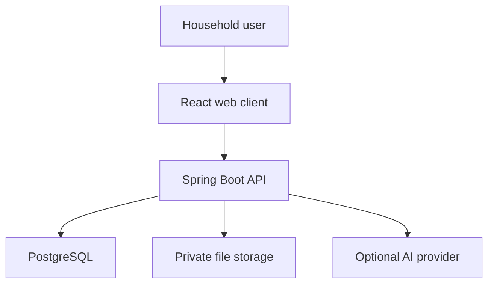
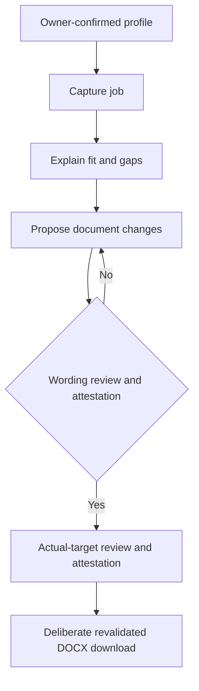

# System Architecture

## Style

Use a Spring Boot modular monolith with explicit module boundaries. React is a separate web client. PostgreSQL and private file storage are deployment dependencies. An optional document worker is introduced only after a proof shows Java cannot meet DOCX fidelity requirements.

## Backend modules

| Module | Responsibility |
| --- | --- |
| Identity | Accounts, authentication, sessions, authorization context |
| Profile | Verified candidate facts and provenance |
| Jobs | Job capture, metadata, normalization, duplicates |
| Fit | Snapshot-attributed requirements, explicit evidence relationships, deterministic scoring API, gaps, and explanations |
| Documents | Base résumé storage, truthful tailoring proposals, approvals, DOCX exports |
| Applications | Pipeline state, notes, follow-ups, history |
| Integrations | AI and future job-source adapters |
| Operations | Health, retention, export, deletion, audit events |

Modules communicate through application interfaces, not direct access to another module's tables. External integrations sit behind ports so deterministic workflows remain testable.

## Primary workflow

The diagram is conceptual: the implemented flow separates ordinary wording approval from actual-target review and target-bound attestation. Only the latter can authorize one ephemeral DOCX response after final transactional revalidation. Documents generates outside locks and reacquires owner-scoped source/proposal/fact/decision locks before releasing validated bytes; no generated file is retained. AI/provider arrows describe future scope, not active network calls. See [ADR-019](decisions/ADR-019-controlled-single-proposal-docx-download.md) and [release gates](security/phase-6-verification.md).

## Boundaries

- The browser is untrusted; authorization is enforced in the backend.
- AI output is untrusted proposed content.
- Job-source content is untrusted input and cannot issue system instructions.
- Files are never served by arbitrary filesystem paths.
- No module may convert an unverified claim into a verified fact.
- Fit requirements are interpretations of job snapshots; evidence links are owner assertions about existing evidence. Derived scores and explanations must not mutate source requirements or candidate evidence. Phase 5C exposes them through a read-only no-store API for one owned snapshot at a time and refuses oversized inputs rather than scoring truncated data. Phase 5D presents that API in the React Jobs workspace with manual requirement review, explicit evidence relationship selection, no browser persistence, no local score calculation, and no automatic matching. Phase 5E verifies that boundary with real browser sessions, direct authenticated API calls, sanitized diagnostics, and disposable PostgreSQL-backed execution; it adds no new runtime architecture.
- Phase 6A adds only an internal Documents service boundary for draft résumé tailoring proposals. Drafts pin the current base résumé row ID, optimistic version, and checksum because replacement mutates the current metadata row rather than creating immutable historical rows. Draft evidence links reference current owner-confirmed career facts only; they record user-confirmed support and do not prove wording equivalence, approve content, edit documents, export files, or reuse fit `SUPPORTS` links automatically.

- Phase 6B exposes the draft proposal boundary through authenticated no-store Documents APIs and adds read-only review plus explicit approval/rejection. Approval locks the proposal, pinned source resume row, evidence rows, and current confirmed career facts in one transaction before recording append-only decision history. Approval is owner attestation for one reviewed revision only; it is not export readiness, document editing, application submission permission, or independent verification of the proposed wording.
